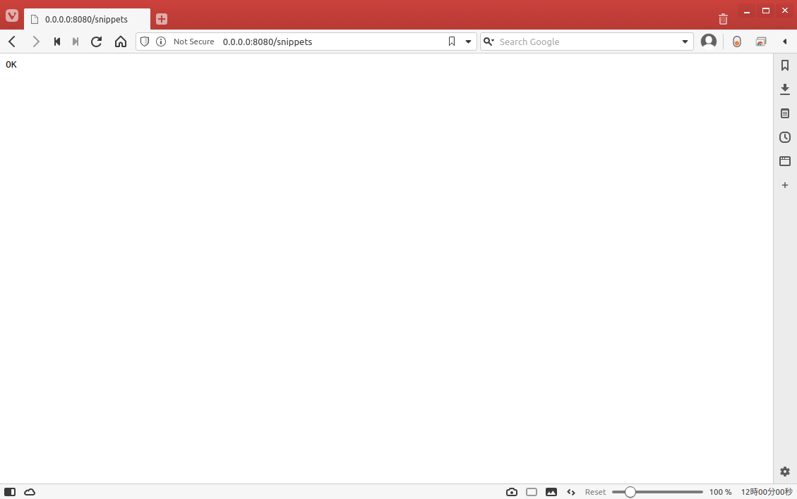
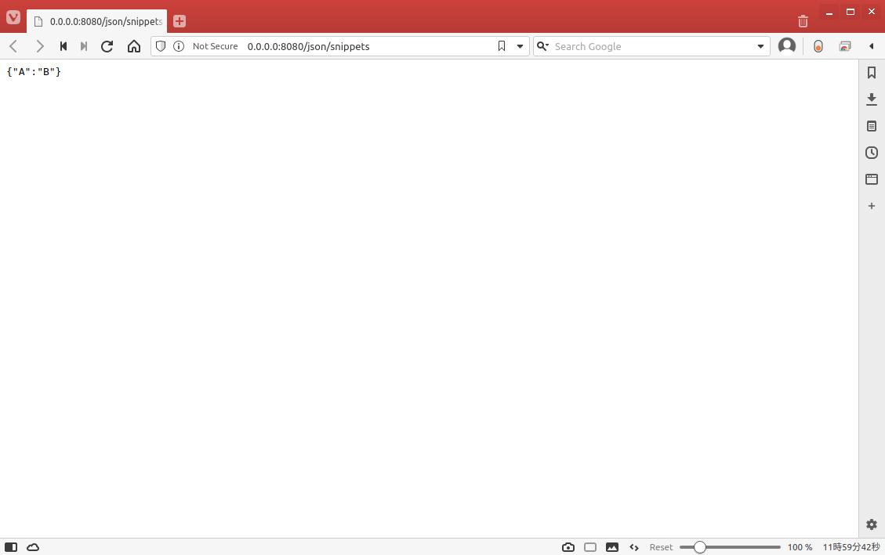
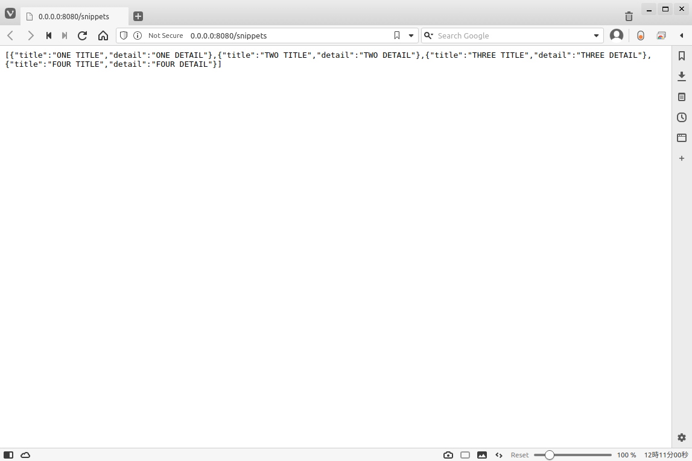

# Ktor で簡単な API を作ってみる

## はじめに

Ktor を利用すれば Web API を作成することができる。今回は一番簡単な API をKtor で作成してみたいと思います。API は Restfull であるなど気にしなければ行けないことはたくさんあると思いますが今回はそういうのは一旦省いてやってみようかなと思います。

## ルーティング

ルーティングを利用するには routing と呼ばれる DSL を記述する。次の例では API GET メソッドを登録しており、/snippets にアクセスしたら "OK"  というテキストが返されるようになっています。

```kotlin
routing {
    get("/snippets") {
        call.respondText("OK")
    }
}
```



-----

ちなみに DSL 次のような定義になっていて、Feature ごとにインストールして使うような構成になっている。

```kotlin
@ContextDsl
fun Application.routing(configuration: Routing.() -> Unit): Routing =
    featureOrNull(Routing)?.apply(configuration) ?: install(Routing, configuration)
```

---

## JSON を返す

API は JSON を返せるようにするには Content Negotiation をインストールして jackson を使うように記述してやる。

```kotlin
install(ContentNegotiation) {
    jackson {
    }
}
```

jackson を使うには build.gradle の dependencies に jackson を追加してやる必要があるので注意。

```
dependencies {
    implementation "io.ktor:ktor-jackson:$ktor_version"
}
```

さっきは call.respondText を使ったが JSON を返す場合には call.respond を利用する。

 call.respond の引数には Map を指定すると、それらの組が JSON として返される API が定義できる。

```kotlin
routing {
    get("/snippets") {
        call.respond(mapOf("A" to "B"))
    }
}
```



また call.respond の引数に List を指定すれば、それらの配列を JSON として返される API が定義される。

```kotlin
data class Snippets(val title: String, val detail: String)

object SnippetsDataFactory {
    val SNIPPETS_DATA = listOf(
        Snippets("ONE TITLE", "ONE DETAIL"),
        Snippets("TWO TITLE", "TWO DETAIL"),
        Snippets("THREE TITLE", "THREE DETAIL"),
        Snippets("FOUR TITLE", "FOUR DETAIL")
    )
}

routing {
    get("/snippets") {
        call.respond(SnippetsDataFactory.SNIPPETS_DATA)
    }
}
```



---

ちなみに[Content Negotiation](https://developer.mozilla.org/ja/docs/Web/HTTP/Content_negotiation) は HTTP に規定されている仕様らしいです。URLにアクセスする際に例えばブラウザがメディアタイプ、言語、文字セット、エンコーディングなどの情報を指定すると、その情報に基づいて最適なリソースを返すための仕組みっぽい。


---------------

